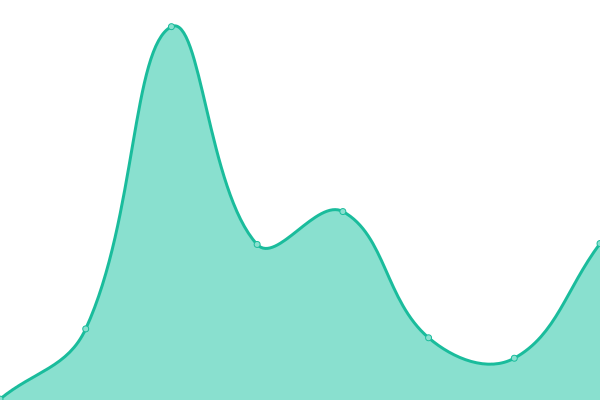

# [📈 Live Status](https://Jst-Tan.github.io/WWW-Uptime-Tracker): <!--live status--> **🟧 Partial outage**

This repository contains the open-source uptime monitor and status page for [Jst Tan](jst-tan.com), powered by [Upptime](https://github.com/upptime/upptime).

With [Upptime](https://upptime.js.org), you can get your own unlimited and free uptime monitor and status page, powered entirely by a GitHub repository. We use [Issues](https://github.com/Jst-Tan/WWW-Uptime-Tracker/issues) as incident reports, [Actions](https://github.com/Jst-Tan/WWW-Uptime-Tracker/actions) as uptime monitors, and [Pages](https://Jst-Tan.github.io/WWW-Uptime-Tracker) for the status page.

<!--start: status pages-->
<!-- This summary is generated by Upptime (https://github.com/upptime/upptime) -->
<!-- Do not edit this manually, your changes will be overwritten -->
<!-- prettier-ignore -->
| URL | Status | History | Response Time | Uptime |
| --- | ------ | ------- | ------------- | ------ |
|  [Google](https://www.google.com) | 🟩 Up | [google.yml](https://github.com/Jst-Tan/WWW-Uptime-Tracker/commits/HEAD/history/google.yml) | 

 610ms
     
 | 

<a href="https://Jst-Tan.github.io/WWW-Uptime-Tracker/history/google">100.00%</a>
    

|  [Wikipedia](https://en.wikipedia.org) | 🟩 Up | [wikipedia.yml](https://github.com/Jst-Tan/WWW-Uptime-Tracker/commits/HEAD/history/wikipedia.yml) | 

 247ms
     
 | 

<a href="https://Jst-Tan.github.io/WWW-Uptime-Tracker/history/wikipedia">100.00%</a>
    

|  [Bluesky App](https://bsky.app/) | 🟩 Up | [bluesky-app.yml](https://github.com/Jst-Tan/WWW-Uptime-Tracker/commits/HEAD/history/bluesky-app.yml) | 

 159ms
     
 | 

<a href="https://Jst-Tan.github.io/WWW-Uptime-Tracker/history/bluesky-app">100.00%</a>
    

|  [Facebook](https://facebook.com) | 🟩 Up | [facebook.yml](https://github.com/Jst-Tan/WWW-Uptime-Tracker/commits/HEAD/history/facebook.yml) | 

 719ms
     
 | 

<a href="https://Jst-Tan.github.io/WWW-Uptime-Tracker/history/facebook">100.00%</a>
    

|  [PayPal](https://www.paypal.com) | 🟩 Up | [pay-pal.yml](https://github.com/Jst-Tan/WWW-Uptime-Tracker/commits/HEAD/history/pay-pal.yml) | 

 545ms
     
 | 

<a href="https://Jst-Tan.github.io/WWW-Uptime-Tracker/history/pay-pal">100.00%</a>
    

|  [Reddit](https://www.reddit.com/) | 🟥 Down | [reddit.yml](https://github.com/Jst-Tan/WWW-Uptime-Tracker/commits/HEAD/history/reddit.yml) | 

 92ms
     
 | 

<a href="https://Jst-Tan.github.io/WWW-Uptime-Tracker/history/reddit">0.00%</a>
    

|  [Huzzler.so](https://huzzler.so/) | 🟩 Up | [huzzler-so.yml](https://github.com/Jst-Tan/WWW-Uptime-Tracker/commits/HEAD/history/huzzler-so.yml) | 

 1122ms
     
 | 

<a href="https://Jst-Tan.github.io/WWW-Uptime-Tracker/history/huzzler-so">100.00%</a>
    

|  [Twitter (X)](https://x.com/) | 🟩 Up | [twitter-x.yml](https://github.com/Jst-Tan/WWW-Uptime-Tracker/commits/HEAD/history/twitter-x.yml) | 

 168ms
     
 | 

<a href="https://Jst-Tan.github.io/WWW-Uptime-Tracker/history/twitter-x">100.00%</a>
    

|  [GitHub](https://github.com) | 🟩 Up | [git-hub.yml](https://github.com/Jst-Tan/WWW-Uptime-Tracker/commits/HEAD/history/git-hub.yml) | 

 176ms
     
 | 

<a href="https://Jst-Tan.github.io/WWW-Uptime-Tracker/history/git-hub">100.00%</a>
    

|  [Roblox](https://roblox.com) | 🟩 Up | [roblox.yml](https://github.com/Jst-Tan/WWW-Uptime-Tracker/commits/HEAD/history/roblox.yml) | 

 337ms
     
 | 

<a href="https://Jst-Tan.github.io/WWW-Uptime-Tracker/history/roblox">100.00%</a>
    

|  [CoinMarketCap](https://coinmarketcap.com/) | 🟩 Up | [coin-market-cap.yml](https://github.com/Jst-Tan/WWW-Uptime-Tracker/commits/HEAD/history/coin-market-cap.yml) | 

 167ms
     
 | 

<a href="https://Jst-Tan.github.io/WWW-Uptime-Tracker/history/coin-market-cap">100.00%</a>
    

<!--end: status pages-->

[**Visit our status website →**](https://Jst-Tan.github.io/WWW-Uptime-Tracker)

## 📄 License

- Powered by: [Upptime](https://github.com/upptime/upptime)
- Code: [MIT](./LICENSE) © [Anand Chowdhary](https://anandchowdhary.com), supported by [Pabio](https://pabio.com)
- Data in the `./history` directory: [Open Database License](https://opendatacommons.org/licenses/odbl/1-0/)
